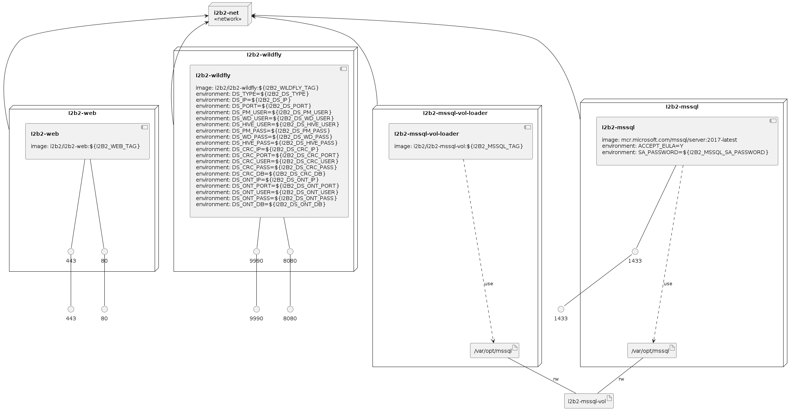

# i2b2-docker
Quick Start for I2B2 using docker compose

## steps
    1. git clone https://github.com/i2b2/i2b2-docker
    2. cd i2b2-docker/mssql	
    3. docker-compose up -d 
    4. verify that webclient is working on http://localhost/webclient
    
## to connect to diffirent data sources for the i2b2 cells
    5. docker-compose down
    6. modify .env file
    7. repeat steps 1 and 2 
    
## to use postgresql container
    8. in step 2 cd to i2b2-docker/pg folder

For assistance email: support@i2b2clinical.org

### Infrastructure model

